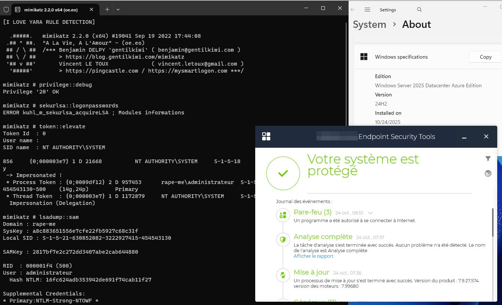
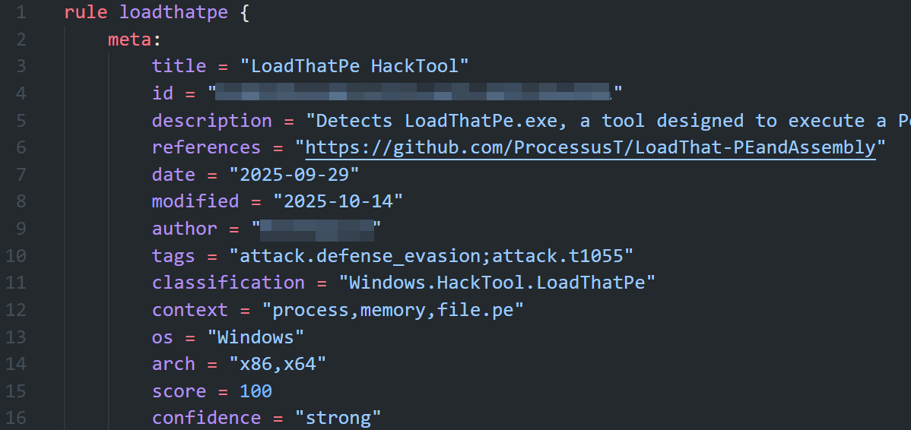
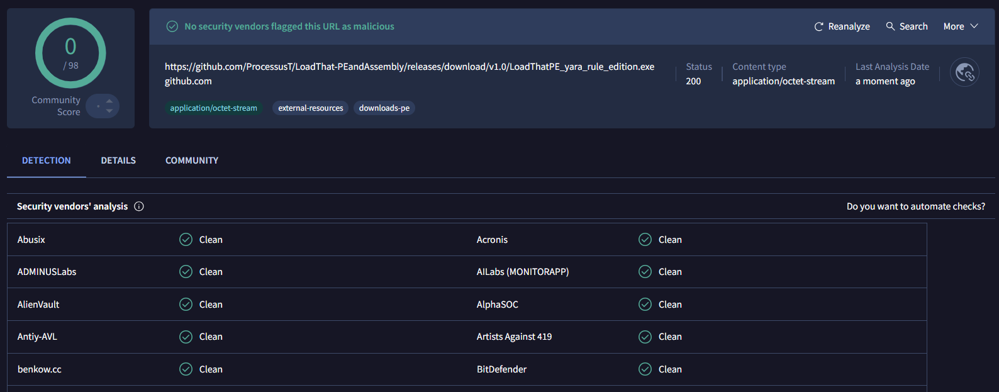

# LoadThatPE



> A simple PE Loader tool that loads a PE from memory, decrypt it, resolve its imports, relocate its sections, and redefine its entry point to execute seamlessly from memory.

## 🚀 Features

- **In-memory decryption**: Decrypts and loads PE files directly from memory.
- **Imports resolution**: Dynamically resolves imports even for complex executables.
- **Section relocation**: Updates section locations based on adjusted memory offsets.
- **Flexible entry point redirection**: Executes the PE with its redefined entry point.

---

# LoadThatAssembly


## ✨ Features

LoadThatAssembly is a native (C/C++) CLR host that:

- Embeds an obfuscated .NET assembly in the binary (encryptedPE),
- Decrypts it in memory via XOR and validates it is a .NET PE (DOS/PE signatures + COM/CLR directory),
- Initializes CLR v4 using ICLRMetaHost/ICLRRuntimeInfo and starts ICorRuntimeHost,
- Opens the Default AppDomain and loads the assembly directly from a SAFEARRAY
- Retrieves the entry point and invokes it, passing the process arguments as a string[].

Everything is performed fully in memory; no file is written to disk.

> **⚠️ About AMSI/ETW patching**
Before loading the assembly, the program calls:
**patchScanBuffer()**: patches AmsiScanBuffer in amsi.dll,
**patchEcritureEvent()**: patches EtwEventWrite in ntdll.dll.

---

This tool is strictly for **educational and research purposes**. Misuse of this tool for malicious or unauthorized activities is strictly prohibited. Respect the laws and ethical guidelines of your jurisdiction.

---

## 🛠️ Installation

- LoadThat-Assembly
```bash
git clone https://github.com/ProcessusT/LoadThat-PEandAssembly.git
cd LoadThatAssembly
python3 encrypt_pe.py <YOUR_PE.exe> <encrypted_pe.txt>
```
Then, replace "unsigned char encryptedPE[]", "size_t encryptedPESize" and "const unsigned char xorKey" into the loader and compile !

- LoadThat-PE
```bash
git clone https://github.com/ProcessusT/LoadThat-PEandAssembly.git
cd LoadThatPE
python3 encrypt_pe.py <YOUR_PE.exe> <encrypted_pe.txt>

x86_64-w64-mingw32-g++ --static \
    -O3 -flto -fwhole-program -ffast-math \
    -s -Wl,--strip-all -fno-exceptions -fno-rtti \
    -fno-ident -fexceptions \
    -Wl,--build-id=sha1 \
    -Wl,--image-base=0x10000000 \
    -fomit-frame-pointer -momit-leaf-frame-pointer \
    -finline-functions -finline-limit=1000 \
    -fno-plt -mno-red-zone \
    -static-libgcc -static-libstdc++ \
    -Wl,--gc-sections -ffunction-sections -fdata-sections \
    encrypted_pe.cpp -o yara_rule_edition.exe
```

---

### 👼 YARA Rule edition implementations 👼



- Multiple XOR encoding (random times)
- Randomized Variables and functions names
- Random sized chunks of PE
- String "[I LOVE YARA RULE DETECTION]" added to ease detection

