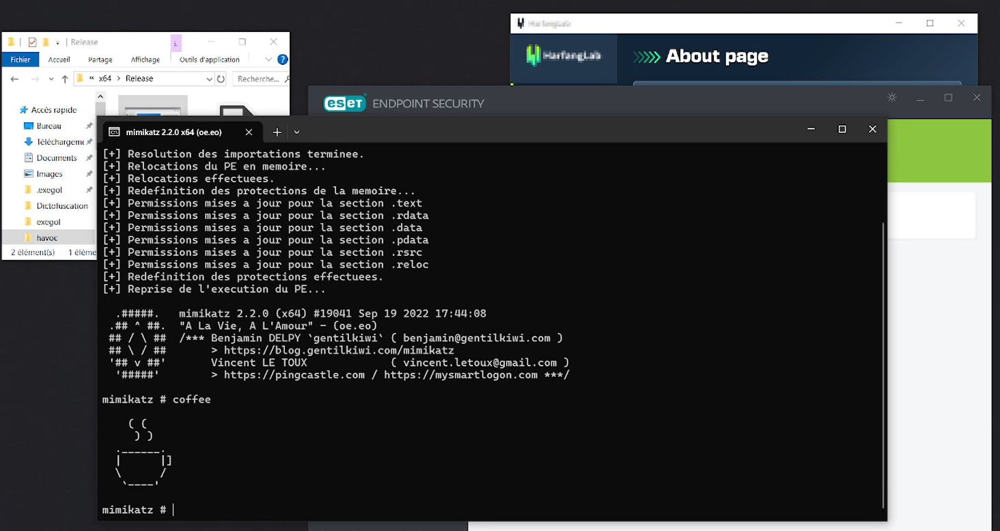
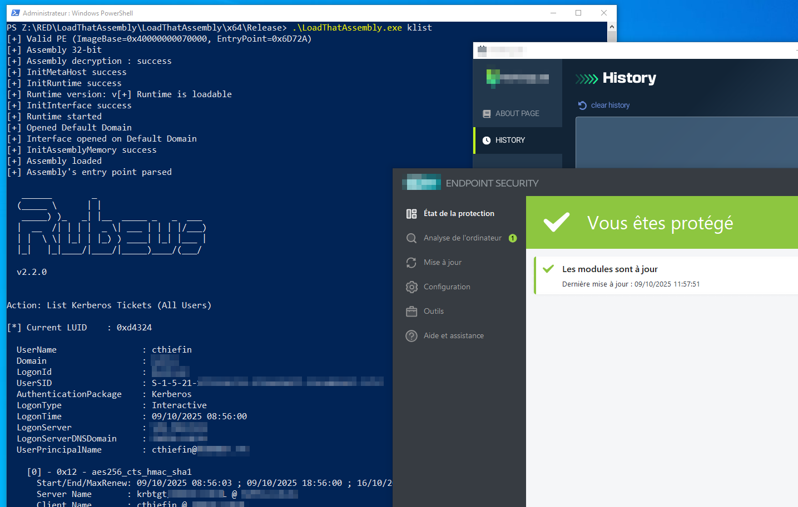

# LoadThatPE



> A simple PE Loader tool that loads a PE from memory, decrypt it, resolve its imports, relocate its sections, and redefine its entry point to execute seamlessly from memory.

## 🚀 Features

- **In-memory decryption**: Decrypts and loads PE files directly from memory.
- **Imports resolution**: Dynamically resolves imports even for complex executables.
- **Section relocation**: Updates section locations based on adjusted memory offsets.
- **Flexible entry point redirection**: Executes the PE with its redefined entry point.

---

# LoadThatAssembly



## ✨ Features

LoadThatAssembly is a native (C/C++) CLR host that:

- Embeds an obfuscated .NET assembly in the binary (encryptedPE),
- Decrypts it in memory via XOR and validates it is a .NET PE (DOS/PE signatures + COM/CLR directory),
- Initializes CLR v4 using ICLRMetaHost/ICLRRuntimeInfo and starts ICorRuntimeHost,
- Opens the Default AppDomain and loads the assembly directly from a SAFEARRAY
- Retrieves the entry point and invokes it, passing the process arguments as a string[].

Everything is performed fully in memory; no file is written to disk.

> **⚠️ About AMSI/ETW patching**
Before loading the assembly, the program calls:
**patchScanBuffer()**: patches AmsiScanBuffer in amsi.dll,
**patchEcritureEvent()**: patches EtwEventWrite in ntdll.dll.

---

This tool is strictly for **educational and research purposes**. Misuse of this tool for malicious or unauthorized activities is strictly prohibited. Respect the laws and ethical guidelines of your jurisdiction.

---

## 🛠️ Installation

### Prerequisites (LoadThatPE)

- `Windows` operating system (recommended for PE file handling).
- `Visual Studio` or `GCC` for compiling the project.
- `C/C++` compiler for maximum performance.

### Prerequisites (LoadThatAssembly)

- `Windows` operating system with .NET Framework 4.x installed (targets v4.0.30319).
- `Visual Studio` (MSVC toolset) + Windows SDK.
- Linking/Interop:
- `mscoree.lib` (via #pragma comment(lib, "mscoree.lib")).
- `mscorlib.tlb` import (via #import "mscorlib.tlb" …), requires the Framework/SDK to be present.
- COM initialization (CoInitializeEx(COINIT_MULTITHREADED) is handled by the program).


### Clone the Repository

```bash
git clone https://github.com/ProcessusT/LoadThat-PEandAssembly.git
cd LoadThatPE | cd LoadThatAssembly
python3 encrypt_pe.py <YOUR_PE.exe> <encrypted_pe.txt>
```
Then, replace "unsigned char encryptedPE[]", "size_t encryptedPESize" and "const unsigned char xorKey" into the loader and compile !
