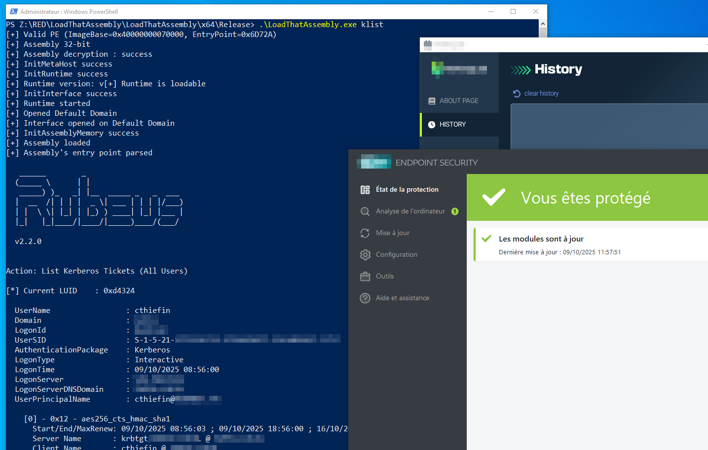

# LoadThatPE


> A polymorphic in-memory PE loader. Encodes, obfuscates, and executes a PE 
> entirely from memory — no file written to disk.

## 🚀 Features

- **Word dictionary encoding** — each payload byte mapped to a unique English word from a 10,000-word corpus
- **Polymorphic chunking** — payload split into randomly-sized chunks stored in shuffled order, unique binary on every generation
- **In-memory execution** — decrypts, maps, resolves imports, relocates sections and transfers execution via thread context hijacking
- **SHA-256 Proof-of-Work** — ~40–50s anti-sandbox delay before execution
- **Stack strings** — sensitive API names (`LoadLibraryA`, `GetProcAddress`, `VirtualAlloc`...) built char-by-char at runtime
- **Full identifier randomization** — all C++ function/variable names randomized at generation time
- **PE metadata spoofing** — linker spoofed to MSVC VS2019, timestamp randomized, Rich header wiped, compiler strings zeroed
- **Authenticode signature theft** — valid-looking signature metadata borrowed from PsExec64

---

# LoadThatAssembly



## ✨ Features

LoadThatAssembly is a native (C/C++) CLR host that:

- Embeds an obfuscated .NET assembly in the binary (encryptedPE)
- Decrypts it in memory via XOR and validates it is a .NET PE (DOS/PE signatures + COM/CLR directory)
- Initializes CLR v4 using ICLRMetaHost/ICLRRuntimeInfo and starts ICorRuntimeHost
- Opens the Default AppDomain and loads the assembly directly from a SAFEARRAY
- Retrieves the entry point and invokes it, passing the process arguments as a string[]

Everything is performed fully in memory; no file is written to disk.

> **⚠️ About AMSI/ETW patching**  
> Before loading the assembly, the program calls:  
> **patchScanBuffer()**: patches AmsiScanBuffer in amsi.dll  
> **patchEcritureEvent()**: patches EtwEventWrite in ntdll.dll

---

This tool is strictly for **educational and research purposes**. Misuse of this tool 
for malicious or unauthorized activities is strictly prohibited. Respect the laws 
and ethical guidelines of your jurisdiction.

---

## 🛠️ Installation

### LoadThat-PE (Word Dictionary Edition)

```bash
git clone https://github.com/ProcessusT/LoadThat-PEandAssembly.git
cd LoadThatPE
python3 encrypt_pe.py <YOUR_PE.exe>

# requirements
apt install mingw-w64
pip3 install pefile requests
```

### LoadThat-Assembly

```bash
git clone https://github.com/ProcessusT/LoadThat-PEandAssembly.git
cd LoadThatAssembly
python3 encrypt_pe.py <YOUR_PE.exe> <encrypted_pe.txt>
```
Then, replace "unsigned char encryptedPE[]", "size_t encryptedPESize" and "const unsigned char xorKey" into the loader and compile !


## Disclaimer

This release is purely for educational and research purposes. Use responsibly.